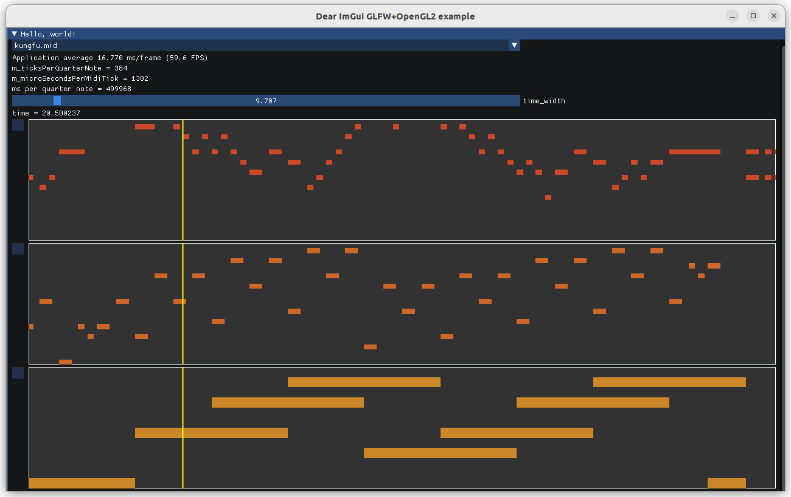

# SimpleMidi
An experimental simple midi player:

- Supports Windows and Linux
- Plays audio asynchronously
- Features a basic square wave synthesizer (sounds like a gameboy)



## Getting started
First create the solution/makefile:
```
$ git clone --recursive https://github.com/aguaviva/SimpleMidi.git
$ cd SimpleMidi
$ mkdir build
$ cd build
$ cmake ..
$ make
```

then build it and run it:
- Windows: open and run the solution, the audio will play right away
- Linux: run make, copy the *SimpleMidi* into its parent dir so it can find the mid file, then you can run it.

## Known issues
Due to its simple nature it just won't play every single midi file, use at your own risk

## Future work
Use fixed point so it runs on an arduino/ESP8266.

